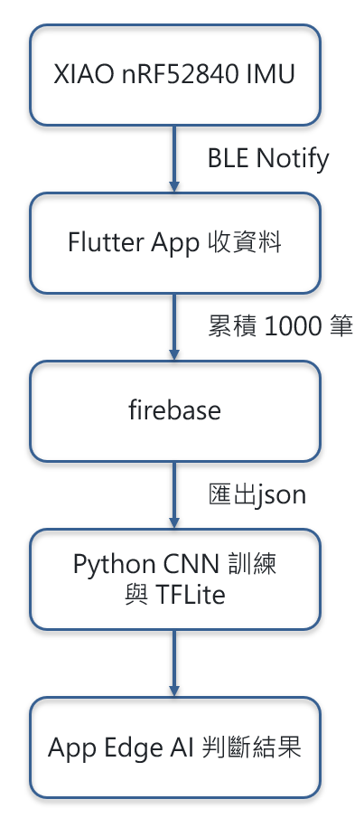
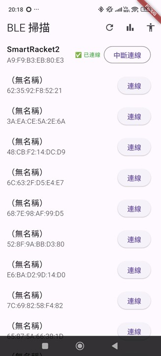

# 🏸 智慧羽球拍IMU系統（Smart Racket IMU System）

本專案為智慧羽球拍 IMU 資料蒐集、雲端儲存與動作分析系統。

- XIAO nRF52840 Sense 韌體（IMU 取樣、BLE 即時傳輸）
- Flutter App（BLE 掃描與連線、資料解析、批次上傳）
- Firebase Firestore 雲端資料架構設計
- App 端控制 IMU 批次上傳（每 1000 筆）
- Python CNN 模型訓練與 TFLite 模型導出
- 手機端 Edge AI 推論整合
- 完整資料流程設計：Sensor → BLE → App → Firestore → ML → TFLite
      
      
      
      XIAO nRF52840 IMU  
            ↓ BLE Notify  
      Flutter App 收資料（20ms/筆）  
            ↓ 累積 1000 筆  
      Firebase Firestore  
            ↓ 匯出  
      Python CNN 訓練與 TFLite  
            ↓  
      App Edge AI 推論


---

## App 頁面

| BLE 掃描頁 | IMU 即時資料頁 | 上傳控制 |
|------------|----------------|----------|
|  |      |  |

---

# 系統功能

---

# 1. 韌體開發 — XIAO nRF52840 Sense

### ✔ IMU 感測資料
- 感測器使用 LSM6DS3（加速度 + 陀螺儀）
- 固定採樣頻率：**20 ms（50 Hz）**
- 韌體端不負責緩衝、不分批、不累積資料

### ✔ BLE 即時傳輸格式（30 bytes）
```
timestamp (4 bytes)
aX, aY, aZ (float * 3)
gX, gY, gZ (float * 3)
rawVoltage (2 bytes)
```

### ✔ BLE 自訂 UUID
- Service UUID: `0769bb8e-b496-4fdd-b53b-87462ff423d0`
- Characteristic UUID: `8ee82f5b-76c7-4170-8f49-fff786257090`

---

# 📡 2. Flutter App（BLE + Firebase）

### ✔ BLE 主要功能
- 使用 `flutter_blue_plus`
- 自動排序 SmartRacket 裝置
- 掃描、連線、斷線自動重連
- 解析 30 bytes Notify 資料

### ✔ IMU 即時資料顯示
- 高速 BLE Notify 資料即時顯示

### ✔ App 控制批次上傳（1000 筆）
- 可手動控制是否要上傳資料到 Firestore
- 每 20ms 收到 1 筆資料
- 累積至 1000 筆即自動打包上傳
- 上傳成功後清空 buffer
- 無資料重疊（overlap）

---

# 3. Firebase Firestore 資料格式
### ✔ 上傳格式如下

```
IMUData/
    Data_yyyyMMdd_HHmmssSSS
        data: {
            "D_0000": { time, timestamp, aX, aY, aZ, gX, gY, gZ },
            "D_0001": {...},
            ...
            "D_0999": {...}
        }
```

### ✔ 優點
- 一次上傳 1000 筆 → Firestore API 使用量低
- Map KEY（D_0000～D_0999）序列固定 → ML 重建資料方便
- 易於匯出成 CSV → 給模型訓練與標註用

---

# 4. 機器學習（CNN）與 TFLite 模型

### ✔ 資料前處理
- 將 IMU 資料切片成固定長度 Window（40 frames）
- 分類目標：smash / drive / other
- 採用資料平衡策略（過採樣／下採樣）

### ✔ 模型架構（依照程式碼）

- Conv2D (16 filters, 2×2, ReLU)
- BatchNormalization
- Dropout (0.2)
- Conv2D (32 filters, 2×2, ReLU)
- Dropout (0.1)
- Flatten
- Dense(64, ReLU, L2=0.01)
- Dense(3, Softmax)

### ✔ 訓練輸入格式
```
input_shape = (40, 6, 1)
```

---

### ✔ 模型轉換與部署
- TensorFlow → TFLite  
- 輸出名稱：`badminton_model.tflite`
- App 推論輸入格式：`[1, 40, 6, 1]`
- 可在手機端即時顯示揮拍判斷結果

---

# 5. 專案資料夾結構

```
smart-racket-imu-system/
├── firmware/          # 感測器韌體
├── flutter_app/       # BLE + Firestore
├── firebase/          # Firestore 結構文件
├── ml_model/          # CNN 訓練與 TFLite 模型
├── dataset/           # 小型示例資料（不含大型 raw data）
├── assets/            # 圖片/靜態資源
└── README.md
```

---

# 作者
許少麒（Ken Xu）  

